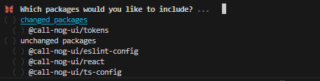
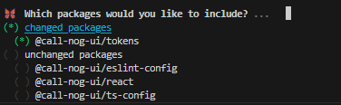
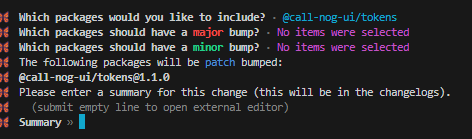
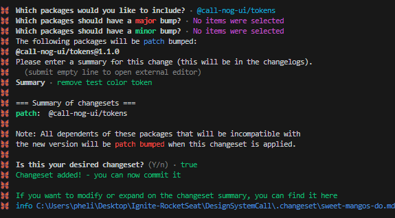
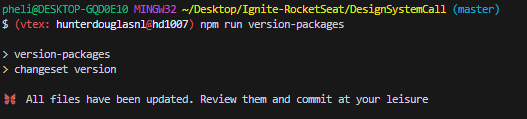
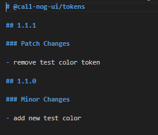
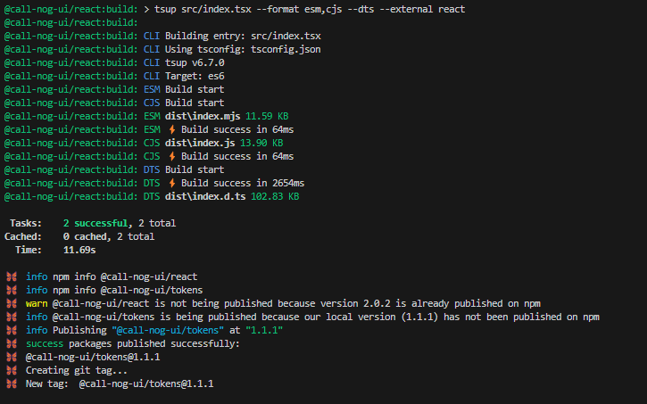
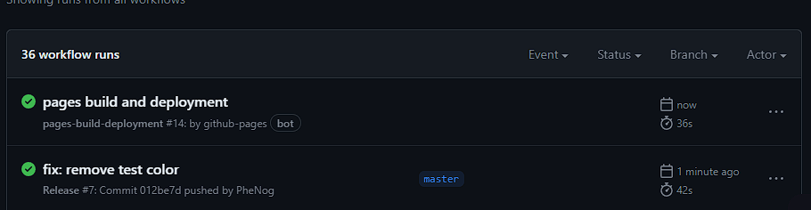

<h1 align="center">Call-Nog UI</h1>

---

<p align="center">
 <a href="#sobre-o-projeto">Sobre o projeto</a> |
 <a href="#layout">Layout</a> | 
 <a href="#tokens">Tokens</a> |  
 <a href="#components">Components</a> |  
 <a href="#como-usar">Como usar</a>  |  
 <a href="#release-e-deploy">Release/Deploy</a> 
</p>

<h4 align="center">
   Status: Finalizado. (Novos components serão adicionados com o tempo)
</h4>

## Sobre o projeto💻
## Call-Nog UI
Design System com padrões de projeto, components e suas respectivas documentações utilizando storybook para visualização e testes interativos de funcionamento e acessibilidade via interface, além de tokens como espaçamentos, cores, fonts  e etc.
### Tokens:
- [x] Colors
- [x] Font Sizes
- [x] Font Weights
- [x] Font Families
- [x] Line Heights
- [x] Radii
- [x] Spaces
### Components:
- [x] Text
- [x] Heading
- [x] Box
- [x] Button
- [x] TextInput
- [x] TextArea
- [x] CheckBox
- [x] Avatar
- [x] MultiStep

#### Funcionalidades

- [X] Listagem de componentes e tokens documentados via storybook.

- [X] Possibilidade de interação com os componentes e suas variações via interface

- [X] Testes de acessibilidade dos componentes integrados no storybook

- [X] Releases automatizadas e controle de varios pacotes com changesets aliado as github actions

- [X] Criação do changelog automatica via CLI.

- [X] Deploy automatizado com storybook/deployer aliado as github actions

#### Tecnologias

Temos 3 pacotes criados para esse projeto, utilizamos o conceito monorepo com auxilio do turboRepo e changesets para maior facilidade no build da aplicação completa, assim como deploy automatizado e gerenciamento dos pacotes, que são:
### @call-nog-ui/react
### @call-nog-ui/tokens
### @call-nog-ui/docs

As seguintes ferramentas/biliotecas foram usadas na construção do projeto:

- [x] [TypeScript](https://www.typescriptlang.org/): TypeScript é uma linguagem de programação que é um superset do JavaScript. Ela adiciona tipos estáticos opcionais ao JavaScript, o que ajuda na detecção de erros antes da execução do código.

- [x] [React](https://reactjs.org/): React é uma biblioteca JavaScript para construir interfaces de usuário. Ela permite criar componentes reutilizáveis que são atualizados de forma eficiente quando os dados mudam.

- [x] [StoryBook](https://storybook.js.org/): O Storybook é uma ferramenta de desenvolvimento para UI (Interface do Usuário) que facilita a criação e visualização de componentes de forma isolada.

- [x] [Stitches](https://stitches.dev/): Stitches é uma biblioteca para a construção de estilos em JavaScript. Ela permite escrever estilos utilizando JavaScript ao invés de arquivos CSS.

- [x] [Radix-UI](https://www.radix-ui.com/): Radix-UI fornece um conjunto de componentes acessíveis e com boa semântica HTML para o desenvolvimento de interfaces web.

- [x] [Phosphor-react](https://www.npmjs.com/package/phosphor-react): phosphor-react é um conjunto de ícones para aplicações web, fornecendo uma variedade de ícones prontos para uso.

- [x] [TurboRepo](https://www.npmjs.com/package/turbo): TurboRepo é uma ferramenta de linha de comando para gerenciar pacotes JavaScript. Ela pode ser usada para instalar, atualizar e remover dependências de um projeto.

- [x] [Vite](https://vitejs.dev/): Vite é um construtor de aplicações web rápido que utiliza esquemas de importação ESModule nativos para melhorar o tempo de desenvolvimento.

- [x] [Eslint](https://eslint.org/): ESLint é uma ferramenta de linting para JavaScript. Ela ajuda a encontrar e corrigir problemas no código, mantendo um estilo de código consistente.

- [x] [@changesets/cli](https://www.npmjs.com/package/@changesets/cli): Changesets é uma ferramenta para gerenciar mudanças e releases em projetos JavaScript com múltiplos pacotes.

- [x] [tsup](https://www.npmjs.com/package/tsup): tsup é um empacotador de módulos TypeScript para projetos pequenos e eficientes.

- [x] [storybook/addon-a11y](https://storybook.js.org/addons/@storybook/addon-a11y): Este é um addon para o Storybook que ajuda a identificar e corrigir problemas de acessibilidade em componentes.

- [x] [storybook/storybook-deployer](https://www.npmjs.com/package/@storybook/storybook-deployer): Este é um pacote que permite implantar a documentação do Storybook em diferentes plataformas.


___

### Como usar
#### Pré-requisitos

Antes de começar, você vai precisar ter instalado em sua máquina as seguintes ferramentas:
[Git](https://git-scm.com),  Além disto é bom ter um editor para trabalhar com o código como [VSCode](https://code.visualstudio.com/)

##### Clone este repositório
```bash
git clone https://github.com/PheNog/DesignSystemCall.git
```
##### Após clonar, acesse a pasta raiz do projeto no terminal/cmd e instale as dependências
```bash
npm install
# ou npm i
```

##### Para executar o projeto, rode o seguinte comando na raíz:
```bash
npm run dev
```
___


# Release/Deploy de alterações

Para fazer o deploy automatizado, utilizamos o storybook/deployer junto de actions no github, configuramos que ao fazer um push na branch master o deploy ocorra de forma automatica, temos também um cache system em nuvem na vercell para maior velocidade no build/deploy da aplicação, para uma release/deploy siga os seguintes passos:

### Changeset para gerenciar as alterações nos pacotes:
```bash
npm run changeset
```


Selecione todos pacotes que tiveram mudanças em "changed packages" ou selecione um a parte para fazer uma release de apenas um dos pacotes. 



Selecione se os pacotes tiveram mudanças MAJOR, MINOR ou PATCH, apenas aperte enter sem selecionar o pacote que ele vai na sequencia de major a patch, no exemplo utilizaremos a patch removendo um token de color teste incluido anteriormente para exemplo:



Aqui em summary, descreva as mudanças que ocorreram nos pacotes e que ficarão no changelog do projeto automaticamente.



Após isso você deve confirmar suas alterações, e o primeiro passo foi completo.

### Utilize o comando:
```bash
npm run version-packages
```
esse comando ira alterar as versões do pacote automaticamente conforme nossa configuração anterior, alem de automaticamente atualizar o changelog do pacote referido com as alterações.

Changelog:



### Release dos pacotes alterados no NPM:
```bash
npm run release
```


### Deploy

De um push na branch master do projeto e o storybook deployer vai utilizar as actions para fazer todo processo de build deploy automaticamente, além de utilizar o cache remoto na vercel para otimizar o tempo de deployment, pode checar o resultado na parte de actions do repo.



## Link do projeto deployado
https://phenog.github.io/DesignSystemCall/